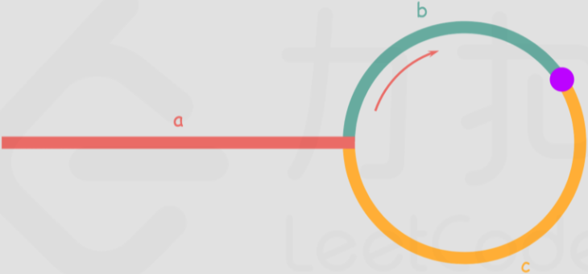

# [题目](https://leetcode-cn.com/problems/linked-list-cycle-ii/)

给定一个链表，返回`链表开始入环的第一个节点`。 如果链表无环，则返回`null`。

为了表示给定链表中的环，使用整数`position`来表示链表尾连接到链表中的位置（索引从$$0$$开始）。 如果`position`是$$-1$$，则在该链表中没有环。注意，`position`仅仅是用于标识环的情况，并不会作为参数传递到函数中。

说明：不允许修改给定的链表。

示例：


```markdown
输入：head = [3, 2, 0, -4], pos = 1
输出：返回索引为 1 的链表节点
解释：链表中有一个环，其尾部连接到第二个节点。
```


# 哈希表

使用哈希表遍历链表中的每个节点，并将它记录下来。一旦遇到了此前遍历过的节点，就可以判定链表中存在环，并且可以立即返回链表入环位置。

## 代码实现

```java
import java.util.HashSet;
import java.util.Set;

/**
 * 142. 环形链表 II
 * 寻找链表的入环位置
 * @author chenzufeng
 * @date 2021-06-27
 */
public class No142_LinkedListCycle2 {
    public SinglyLinkedListNode detectCyclePosition(SinglyLinkedListNode head) {
        // position为链表的入环位置
        SinglyLinkedListNode position = head;
        // HashSet存储的元素为不重复、无序的，由于存入的是节点（Node的属性包括 value、nextNode）
        Set<SinglyLinkedListNode> visitedPosition = new HashSet<>();
        
        while (position != null) {
            if (visitedPosition.contains(position)) {
                return position;
            } else {
                visitedPosition.add(position);
            }
            position = position.nextNode;
        }
        
        // 链表没有环
        return null;
    }
}
```


## 复杂度分析

- 时间复杂度：$$O(N)$$，其中 $$N$$ 为链表中节点的数目。恰好需要访问链表中的每一个节点。

- 空间复杂度：$$O(N)$$，其中 $$N$$ 为链表中节点的数目。需要将链表中的每个节点都保存在哈希表当中。


# 快慢指针

使用两个指针，$\textit{fast}$ 与 $$\textit{slow}$$。它们起始都位于链表的头部。随后，$$\textit{slow}$$ 指针每次向后==移动一个位置==，而 $$\textit{fast}$$ 指针向后==移动两个位置==。如果链表中存在环，则 $$\textit{fast}$$ 指针最终将再次与 $$\textit{slow}$$ 指针在环中相遇。

如下图所示，设链表中环外部分的长度为 $$a$$​​​。$$\textit{slow}$$​​​ 指针进入环后，又走了 $$b$$​​ 的距离与 $$\textit{fast}$$​​​ 相遇。此时，$$\textit{fast}$$​​​ 指针已经走完了环的 $$n$$​​​​ 圈，因此它走过的总距离为 $$a+n(b+c)+b=a+(n+1)b+nc$$​。



由于 $$\textit{fast}$$ 指针的速度是 $$\textit{slow}$$ 指针的 $2$ 倍，所以 $$\textit{fast}$$ 指针走过的距离为 $$\textit{slow}$$ 指针的 $2$ 倍（==当 $$\textit{fast}$$ 指针走过的距离是 $$\textit{slow}$$ 指针的 $$2$$ 倍时，两个指针相遇，慢指针一定未走完一圈==）。因此，可得

$$a+(n+1)b+nc=2(a+b) \implies a=c+(n-1)(b+c)$$


即，==从相遇点到入环点的距离加上 $$n-1$$​​ 圈的环长，恰好等于从链表头部到入环点的距离==。

因此，

- ==当发现 $$\textit{slow}$$ 与 $$\textit{fast}$$ 相遇时，再额外使用一个指针 $$\textit{ptr}$$。起始，它指向链表头部；==
- ==随后，它和 $$\textit{slow}$$ 每次向后移动一个位置。最终，它们会在入环点相遇==。

## 代码实现

```java
public class Solution {
    public ListNode detectCycle(ListNode head) {
        if (head == null) {
            return null;
        }
        ListNode slow = head, fast = head;
        while (fast != null) {
            slow = slow.next;
            if (fast.next != null) {
                fast = fast.next.next;
            } else {
                return null;
            }
            if (fast == slow) {
                ListNode ptr = head;
                while (ptr != slow) {
                    ptr = ptr.next;
                    slow = slow.next;
                }
                return ptr;
            }
        }
        return null;
    }
}
```

## 复杂度分析

- 时间复杂度：$$O(N)$$，其中 $$N$$​ 为链表中节点的数目。==在最初判断快慢指针是否相遇时，$$\textit{slow}$$ 指针走过的距离不会超过链表的总长度==；随后寻找入环点时，走过的距离也不会超过链表的总长度。因此，总的执行时间为 $$O(N)+O(N)=O(N)$$​。

- 空间复杂度：$$O(1)$$​​​​。只使用了 $$\textit{slow}$$​​​​、$$\textit{fast}$$​​​​、$$\textit{ptr}$$​​​​ 三个指针。

