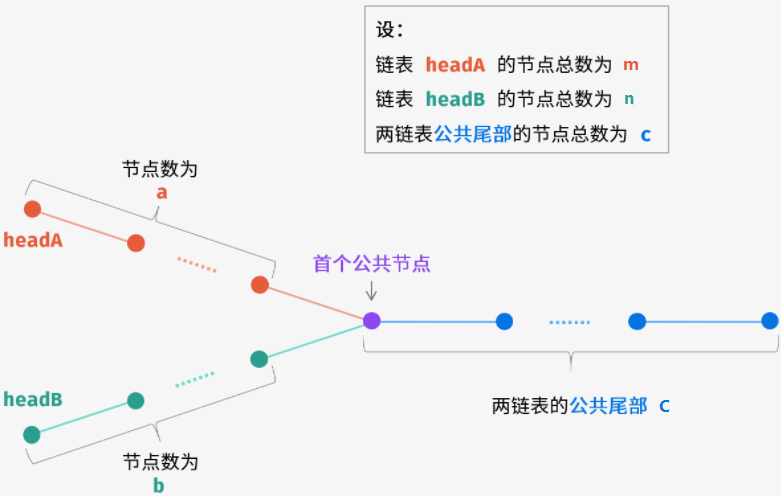

# [题目](https://leetcode-cn.com/problems/intersection-of-two-linked-lists/)

给你两个单链表的头节点 `headA` 和 `headB` ，请你找出并返回两个单链表相交的起始节点。如果两个链表没有交点，返回 `null` 。


```markdown
输入：intersectVal = 8, listA = [4,1,8,4,5], listB = [5,0,1,8,4,5], skipA = 2, skipB = 3
输出：Intersected at '8'
解释：相交节点的值为 8 （注意，如果两个链表相交则不能为 0）。
	  从各自的表头开始算起，链表 A 为 [4,1,8,4,5]，链表 B 为 [5,0,1,8,4,5]。
	  在 A 中，相交节点前有 2 个节点；在 B 中，相交节点前有 3 个节点。
```


# 哈希集合

可以使用哈希集合存储链表节点。

首先遍历链表 $\textit{headA}$，并将链表 $\textit{headA}$ 中的每个节点加入哈希集合中。然后遍历链表 $\textit{headB}$，对于遍历到的每个节点，<font color=red>判断该节点是否在哈希集合中</font>：

- 如果当前节点不在哈希集合中，则继续遍历下一个节点；

- 如果当前节点在哈希集合中，则后面的节点都在哈希集合中，即从当前节点开始的所有节点都在两个链表的相交部分，因此在链表 $\textit{headB}$ 中遍历到的第一个在哈希集合中的节点就是两个链表相交的节点，返回该节点。

- 如果链表 $\textit{headB}$ 中的所有节点都不在哈希集合中，则两个链表不相交，返回 $\text{null}$。

<font color=red>只有当链表 $\textit{headA}$ 和 $\textit{headB}$ 都不为空时，两个链表才可能相交。因此首先判断链表 $\textit{headA}$ 和 $\textit{headB}$ 是否为空，如果其中至少有一个链表为空，则两个链表一定不相交，返回 $\text{null}$。</font>

## 代码实现

```java
public class Solution {
    public ListNode getIntersectionNode(ListNode headA, ListNode headB) {
        Set<ListNode> visited = new HashSet<ListNode>();
        ListNode temp = headA;
        // 遍历链表A
        while (temp != null) {
            // 放入HashSet中的是结点
            // 【结点相同指两个结点地址相同】，值一样不一定是同一个结点
            visited.add(temp);
            temp = temp.next;
        }
        
        temp = headB;
        // 遍历链表B
        while (temp != null) {
            if (visited.contains(temp)) {
                return temp;
            }
            temp = temp.next;
        }
        
        return null;
    }
}
```


## 复杂度分析

- 时间复杂度：$O(m+n)$，其中 $m$ 和 $n$ 是分别是链表 $\textit{headA}$ 和 $\textit{headB}$ 的长度。需要遍历两个链表各一次。

- 空间复杂度：$O(m)$，其中 $m$ 是链表 $\textit{headA}$ 的长度。需要使用哈希集合存储链表 $\textit{headA}$ 中的全部节点。

  

# 双指针

<font color=red>只有当链表 $\textit{headA}$ 和 $\textit{headB}$ 都不为空时，两个链表才可能相交。因此首先判断链表 $\textit{headA}$ 和 $\textit{headB}$ 是否为空，如果其中至少有一个链表为空，则两个链表一定不相交，返回 $\text{null}$。</font>

当链表 $\textit{headA}$ 和 $\textit{headB}$ 都不为空时，创建两个指针 $P_{A}$ 和 $P_{B}$，初始时分别指向两个链表的头节点 $\textit{headA}$ 和 $\textit{headB}$，然后将两个指针依次遍历两个链表的每个节点。具体做法如下：

- 每步操作需要同时更新指针 $P_{A}$ 和 $P_{B}$；

- 如果指针 $P_{A}$ 不为空，则将指针 $P_{A}$ 移到下一个节点；如果指针 $P_{B}$ 不为空，则将指针 $P_{B}$ 移到下一个节点。

- <font color=red>如果指针 $P_{A}$ 为空，则将指针 $P_{A}$ 移到链表 $\textit{headB}$ 的头节点；如果指针 $P_{B}$ 为空，则将指针 $P_{B}$ 移到链表 $\textit{headA}$ 的头节点</font>。

- <font color=red>当指针 $P_{A}$ 和 $P_{B}$ ==指向同一个节点==或者==都为空==时，返回它们指向的节点或者 $\text{null}$</font>。

## 证明



考虑两种情况，第一种情况是两个链表相交，第二种情况是两个链表不相交。

情况一：两个链表相交

链表 $\textit{headA}$ 和 $\textit{headB}$ 的长度分别是 $m$ 和 $n$。假设链表 $\textit{headA}$ 的不相交部分有 $a$ 个节点，链表 $\textit{headB}$ 的不相交部分有 $b$ 个节点，两个链表相交的部分有 $c$ 个节点，则有 $a+c=m$，$b+c=n$。

- 如果 $a=b$，则两个指针会同时到达两个链表相交的节点，此时返回相交的节点；

- <font color=red>如果 $a \ne b$，则指针 $P_{A}$ 会遍历完链表 $\textit{headA}$，指针 $P_{B}$ 会遍历完链表 $\textit{headB}$，两个指针不会同时到达链表的尾节点，然后指针 $P_{A}$ 移到链表 $\textit{headB}$ 的头节点，指针 $P_{B}$ 移到链表 $\textit{headA}$ 的头节点，然后两个指针继续移动，在指针 $P_{A}$ 移动了 $a+c+b$ 次、指针 $P_{B}$ 移动了 $b+c+a$ 次之后，两个指针会同时到达两个链表相交的节点，该节点也是两个指针第一次同时指向的节点，此时返回相交的节点。</font>

情况二：两个链表不相交

链表 $\textit{headA}$ 和 $\textit{headB}$ 的长度分别是 $m$ 和 $n$。考虑当 $m=n$ 和 $m \ne n$ 时，两个指针的移动情况：

- 如果 $m=n$，则两个指针会同时到达两个链表的尾节点，然后同时变成空值 $\text{null}$，此时返回 $\text{null}$；

- 如果 $m \ne n$，则由于两个链表没有公共节点，两个指针也不会同时到达两个链表的尾节点，因此两个指针都会遍历完两个链表，<font color=red>在指针 $P_{A}$ 移动了 $m+n$ 次、指针 $P_{B}$ 移动了 $n+m$ 次之后，两个指针会同时变成空值 $\text{null}$</font>，此时返回 $\text{null}$。


## 代码实现

```java
public class GetIntersectionNode {
    public ListNode getIntersectionNode(ListNode headA, ListNode headB) {
        if (headA == null || headB == null) {
            return null;
        }

        ListNode pointA = headA, pointB = headB;
        // 速度相同，走过相同的路，且有交点，则注定会相遇
        while (pointA != pointB) {
            pointA = (pointA == null) ? headB : pointA.next;
            pointB = (pointB == null) ? headA : pointB.next;
        }

        return pointA;
    }
}
```


## 复杂度分析

时间复杂度：$O(m+n)$，其中 $m$ 和 $n$ 是分别是链表 $\textit{headA}$ 和 $\textit{headB}$ 的长度。两个指针同时遍历两个链表，每个指针遍历两个链表各一次。

空间复杂度：$O(1)$。
