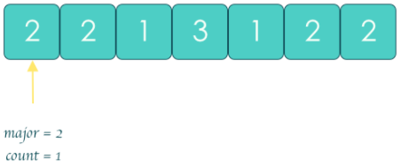
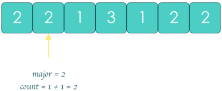
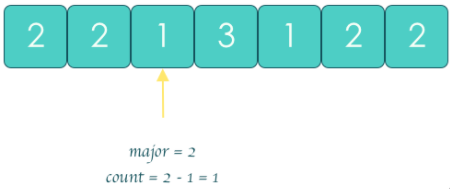
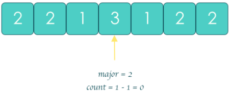
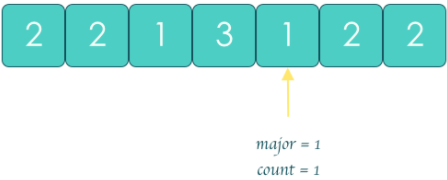
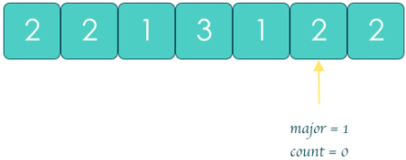
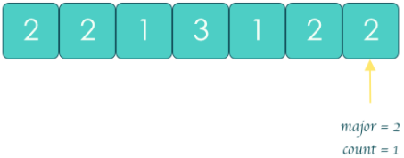

# [题目](https://leetcode-cn.com/problems/majority-element/)

给定一个大小为 $n$ 的数组，找到其中的多数元素。

多数元素是指在数组中<font color=red>出现次数大于 $⌊ n/2 ⌋$</font> 的元素。

你可以假设数组是非空的，并且**给定的数组总是存在多数元素**。


示例：

```markdown
输入：[2,2,1,1,1,2,2]
输出：2
```


# HashMap

## 解题思路

使用哈希映射（HashMap）来存储每个元素以及出现的次数。对于哈希映射中的每个键值对，==键表示一个元素，值表示该元素出现的次数==：

- 用一个循环遍历数组 nums 并将数组中的每个元素加入哈希映射中。
- 在这之后，遍历哈希映射中的所有键值对，返回值最大的键。

也可以==在遍历数组 nums 时候使用打擂台的方法，维护最大的值==，这样省去了最后对哈希映射的遍历。

## 代码实现

```java
class Solution {
    public int majorityElement(int[] nums) {
        Map<Integer, Integer> counts = countNums(nums);
        Map.Entry<Integer, Integer> majorityEntry = null;
        
        // 错误：for (Map.Entry<Integer, Integer> entry : counts.entrySet)
        for (Map.Entry<Integer, Integer> entry : counts.entrySet()) {
            if (majorityEntry == null || entry.getValue() > majorityEntry.getValue()) {
                majorityEntry = entry;
            }
        }

        return majorityEntry.getKey();
    }

    // 遍历数组，并记录每个数值出现的次数
    private Map<Integer, Integer> countNums(int[] nums) {
        Map<Integer, Integer> counts = new HashMap<Integer, Integer>();
        for (int num : nums) {
            if (!counts.containsKey(num)) {
                counts.put(num, 1);
            }
            else {
                counts.put(num, counts.get(num) + 1);
            }
        }
        return counts;
    }
}
```


## 复杂度分析

- 时间复杂度：$O(n)$，其中 $n$ 是数组 nums 的长度。
- 空间复杂度：$O(n)$。


# 排序

## 解题思路

如果将数组 nums 中的所有元素==按照**单调递增**或**单调递减**的顺序排序==，那么==下标==为 $\lfloor \dfrac{n}{2} \rfloor$ 的元素（下标从 0 开始）一定是众数。

## 代码实现

```java
class Solution {
    public int majorityElement(int[] nums) {
        Arrays.sort(nums);
        return nums[nums.length / 2];
    }
}
```


## 复杂度分析

- 时间复杂度：$O(n\log n)$。将数组排序的时间复杂度为 $O(n\log n)$。

- 空间复杂度：$O(\log n)$。如果**使用语言自带的排序算法，需要使用 $O(\log n)$ 的栈空间**。如果自己编写堆排序，则只需要使用 $O(1)$ 的额外空间。


# 摩尔投票法

如果我们把众数记为 $+1$，把其他数记为 $-1$，==将它们全部加起来==，显然和大于 `0`，从结果本身我们可以看出众数比其他数多。

## 解题思路

以 `[2,2,1,3,1,2,2]` 为例。

遍历数组第一个元素 `2` 时，因 `major` 空缺，所以赋值 `major = 2`，且票数 `count = 1`：



发现第二个元素依旧是「候选人」`2`，与 `major` 相同，因此将票数加一：



第三个元素是 `1`，与 `major` 不同，因此发生「对抗」，==将当前 major 的票数冲抵掉 1 票==：



第四个元素是 `3`，又与 `major` 不同，因此产生「对抗」，票数继续冲抵：



当遍历到第五个元素 `1` 时，发现当前 `count` 已经归 `0`，说明 `major` 位置空缺，因此令 `major = 1`，且 `count = 1`：



第六个元素是 `2`，与 `major` 不同，因此进行票数抵消，元素 `1` 刚上位又要下台了：



此时 `count` 又归零了，因此当遍历到最后一个元素 `2` 时，令 `major = 2`，票数 `count = 1`：



至此遍历结束，求出的多数元素为元素 `2`。

## 代码实现

维护一个候选众数 candidate 和它出现的次数 count。初始时 candidate 可以为任意值，count 为 0；

遍历数组 nums 中的所有元素，对于每个元素 x，在判断 x 之前，如果 count 的值为 0，先将 x 的值赋予 candidate，随后判断 x：

- 如果 x 与 candidate 相等，那么计数器 count 的值增加 1；

- 如果 x 与 candidate 不等，那么计数器 count 的值减少 1。

在遍历完成后，candidate 即为整个数组的众数。


```java
class Solution {
    public int majorityElement(int[] nums) {
        int count = 0;
        int candidate = null;

        for (int num : nums) {
            if (count == 0) {
                candidate = num;
            }
            count += (num == candidate) ? 1 : -1;
        }

        return candidate;
    }
}
```


## 复杂度分析

- 时间复杂度：$O(n)$。Boyer-Moore 算法只对数组进行了一次遍历。

- 空间复杂度：$O(1)$。Boyer-Moore 算法只需要常数级别的额外空间。

