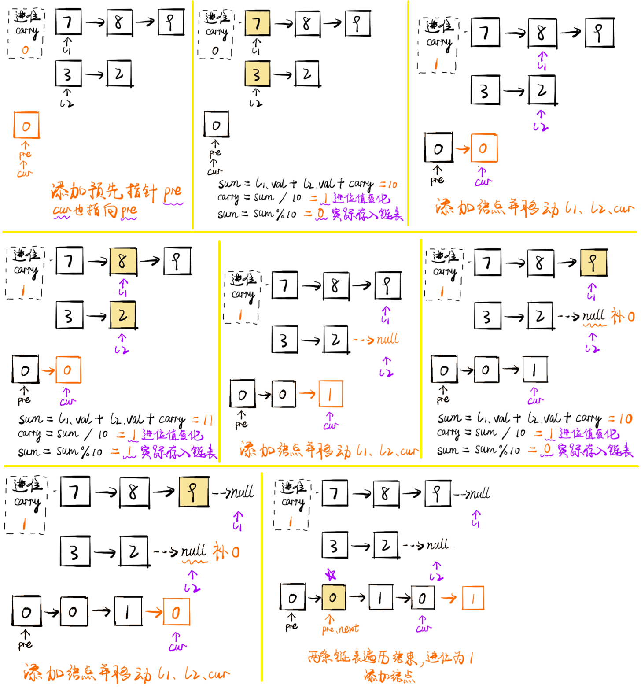

# [题目](https://leetcode-cn.com/problems/add-two-numbers/)

给出两个**非空**的链表，用来表示两个**非负的整数**。其中，它们各自的位数是按照**逆序**的方式存储的，并且它们的每个节点只能存储**一位**数字。

如果，将这两个数相加起来，则会返回一个新的链表来表示它们的和。除了数字 $$0$$​ 之外，这两个数都不会以 $$0$$ ​开头。


示例：

```markdown
输入：(2 -> 4 -> 3) + (5 -> 6 -> 4)
输出：7 -> 0 -> 8
原因：342 + 465 = 807
```


| 测试用例               | 说明                                               |
| :--------------------- | :------------------------------------------------- |
| $l1=[0,1]，l2=[0,1,2]$ | 当一个列表比另一个列表长时                         |
| $l1=[]，l2=[0,1]$      | 当一个列表为空时，即出现空列表                     |
| $l1=[9,9]，l2=[1]$     | 求和运算最后可能出现额外的进位，这一点很容易被遗忘 |


# 解题思路

- 同时遍历两个链表，逐位计算它们的和，并与`当前位置的进位值`相加。
- 如果当前两个链表处相应位置的数字为 $$n1$$​​、$$n2$$​​，进位值为 $$\textit{carry}$$​​，则它们的和为 $$n1+n2+\textit{carry}$$​​；其中，答案链表处相应位置的数字为$(n1+n2+\textit{carry}) \% 10$，而`新的进位值`为$\lfloor\frac{n1+n2+\textit{carry}}{10}\rfloor$​​​。
- 将两个链表看成是相同长度的进行遍历，**如果一个链表较短则在前面补** $$0$$​​​，如$789 + 32 = 789 + 320 = 00101$​
- <font color=red>如果链表遍历结束后，有 $\textit{carry} > 0$​​，还需要在答案链表的后面附加一个节点</font>，节点的值为 $\textit{carry}$。
- 小技巧：对于链表问题，<font color=red>返回结果为头结点时，通常需要先初始化一个预先指针 $preNode$，该指针的下一个节点指向真正的头结点 head</font>。使用预先指针的目的在于，链表初始化时无可用节点值，而且链表构造过程需要指针移动，进而会**导致头指针丢失，无法返回结果**。




# 代码实现

```java
/**
 * 2.两数相加
 * Definition for singly-linked list.
 * public class ListNode {
 *     int val;
 *     ListNode next;
 *     ListNode() {}
 *     ListNode(int val) { this.val = val; }
 *     ListNode(int val, ListNode next) { this.val = val; this.next = next; }
 * }
 */
public class AddTwoNumbers {
    public static ListNode addTwoNumbers(ListNode listNode1, ListNode listNode2) {
        if (listNode1 == null) {
            return listNode2;
        }
        if (listNode2 == null) {
            return listNode1;
        }
        
        // 进位标志
        int carry = 0;
        // [结果链表]头节点的前一个节点（哨兵节点）
        ListNode preNode = new ListNode();
        // 结果链表
        ListNode currentNode = preNode;

        while (listNode1 != null || listNode2 != null) {
            int sum = carry;
            // 如果两个链表不一样长，则补 0
            sum += (listNode1 != null ? listNode1.value : 0);
            sum += (listNode2 != null ? listNode2.value : 0);

            carry = sum / 10;
            currentNode.nextNode = new ListNode(sum % 10);
            currentNode = currentNode.nextNode;

            // 查看两个链表的下一位
            // 注意：这里不能写成 if (listNode1.nextNode != null)
            // 这里与 while (listNode1 != null || listNode2 != null)是相呼应的
            if (listNode1 != null) {
                listNode1 = listNode1.nextNode;
            }
            if (listNode2 != null) {
                listNode2 = listNode2.nextNode;
            }
        }

        // 两个链表都到了尾端，此时还有进位
        if (carry == 1) {
            currentNode.nextNode = new ListNode(carry);
        }

        return preNode.nextNode;
    }
}
```


# 复杂度分析

- 时间复杂度：$O(\max(m,n))$​​​，其中 $m$​​​ 和 $n$​​​ 分别为两个链表的长度。要遍历两个链表的全部位置，而处理每个位置只需要 $O(1)$​​​ 的时间。

- 空间复杂度：$O(1)$。注意，返回值不计入空间复杂度。


