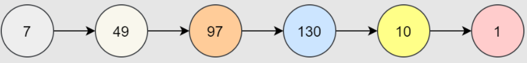
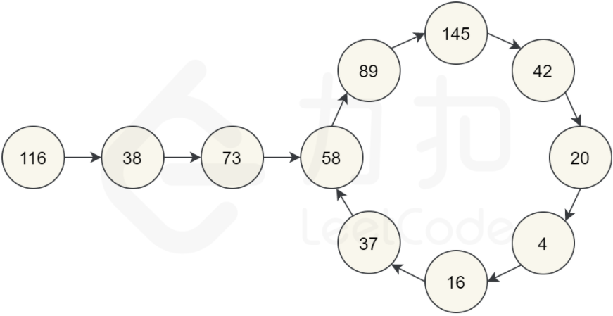

# [题目](https://leetcode-cn.com/problems/happy-number/)

编写一个算法来判断一个数 $n$ 是不是快乐数。

快乐数定义为：

对于一个正整数，==每一次将该数替换为它每个位置上的数字的平方和==。
然后重复这个过程直到这个数变为 1，也可能是无限循环但始终变不到 1。
如果可以变为  1，那么这个数就是快乐数。
如果 $n$ 是快乐数就返回 true ；不是，则返回 false 。


示例：

```markdown
输入：19
输出：true
```

解释：
    $1^2$ + $9^2$ = 82
    $8^2$ + $2^2$ = 68
    $6^2$ + $8^2$ = 100
    $1^2$ + $0^2$ + $0^2$ = 1


# 哈希集

以 $7$ 为例：则下一个数字是 $49$（因为 $7^2=49$），然后下一个数字是 $97$（因为$4^2+9^2=97$）。可以不断重复该的过程，直到得到 $1$。因为得到了 $1$，所以 $7$ 是一个快乐数，函数应该返回 `true`。



以 $116$ 为例：通过反复通过平方和计算下一个数字，最终得到 $58$，再继续计算之后，又回到 $58$。由于回到了一个已经计算过的数字，可以知道有一个循环，因此不可能达到 $1$。所以对于 $116$，函数应该返回 `false`。



根据我们的探索，我们猜测会有以下三种可能：

- 最终会得到 1。
- 最终会进入循环。
- 值会越来越大，最后接近无穷大。

第三个情况比较难以检测和处理。我们怎么知道它会继续变大，而不是最终得到1呢？

我们可以仔细想一想，<font color=red>每一位数的最大数字的下一位数</font>是多少：

| Digits |    Largest    | Next |
| :----: | :-----------: | :--: |
|   1    |       9       |  81  |
|   2    |      99       | 162  |
|   3    |      999      | 243  |
|   4    |     9999      | 324  |
|   13   | 9999999999999 | 1053 |

对于 $3$ 位数的数字，它不可能大于 $243$。这意味着它要么被困在 $243$ 以下的循环内，要么跌到 1。

==$4$ 位或 $4$ 位以上的数字在每一步都会丢失一位，直到降到 $3$ 位为止==。

所以我们知道，==最坏的情况下，算法可能会在 $243$ 以下的所有数字上循环，然后回到它已经到过的一个循环或者回到 $1$。但它不会无限期地进行下去，所以我们**排除第三种情况**==。

## 解题思路


算法分为两部分：

- 给一个数字 $n$，它的下一个数字是什么？
- 按照一系列的数字来判断是否进入了一个循环。

第 1 部分我们按照题目的要求做**数位分离**，求平方和。

第 2 部分可以使用 HashSet 完成。每次生成链中的下一个数字时，我们都会检查它是否已经在 HashSet 中。

- 如果它不在 HashSet 中，我们应该添加它。
- 如果它在 HashSet 中，这意味着我们处于一个循环中，因此应该返回 false。

我们使用 HashSet 而不是向量、列表或数组的原因是：我们==需要反复检查其中是否存在某数字==。<font color=red>**检查数字是否在哈希集中需要$O(1)$的时间**</font>，而对于其他数据结构，则需要 $O(n)$ 的时间。

## 代码实现

```java
class Solution {
    private int getNext(int n) {
        int totalSum = 0;
        // 不断地取余，平方
        while (n > 0) {
            int d = n % 10;
            n = n / 10;
            totalSum += d * d;
        }
        return totalSum;
    }

    public boolean isHappy(int n) {
        Set<Integer> seen = new HashSet<>();
        while (n != 1 && !seen.contains(n)) {
            seen.add(n);
            n = getNext(n);
        }
        return n == 1;
    }
}
```


## 复杂度分析

可以尝试只计算 `getNext(n)` 函数的时间复杂度。

- 时间复杂度：$O(243 \cdot 3 + \log n + \log\log n + \log\log\log n)...= O(\log n)$。
  - 查找给定数字的下一个值的成本为 $O(\log n)$，因为我们正在处理数字中的每位数字，而数字中的位数由 $\log n$ 给定。
  - 要计算出总的时间复杂度，我们需要仔细考虑循环中有多少个数字，它们有多大。
  - 我们在上面确定，一旦一个数字低于 $243$，它就不可能回到 $243$ 以上。因此，我们就可以用 $243$ 以下最长循环的长度来代替 $243$，不过，因为常数无论如何都无关紧要，所以我们不会担心它。
  - 对于高于 $243$ 的 $n$，我们需要考虑循环中每个数高于 $243$ 的成本。通过数学运算，我们可以证明在最坏的情况下，这些成本将是 $O(\log n) + O(\log \log n) + O(\log \log \log n)...$。幸运的是，==$O(\log n)$ 是占主导地位的部分，而其他部分相比之下都很小（总的来说，它们的总和小于$\log n$），所以我们可以忽略它们==。
    

- 空间复杂度：$O(\log n)$。

  与时间复杂度密切相关的是衡量我们放入哈希集合中的数字以及它们有多大的指标。对于足够大的 $n$，大部分空间将由 $n$ 本身占用。我们可以很容易地优化到 $O(243 \cdot 3) = O(1)$，方法是只保存集合中小于 $243$ 的数字，因为对于较高的数字，无论如何都不可能返回到它们。


# 快慢指针

## 解题思路

==通过反复调用 getNext(n) 得到的链是一个隐式的链表==。

隐式意味着我们没有实际的链表节点和指针，但数据仍然形成链表结构。起始数字是链表的头 “节点”，链中的所有其他数字都是节点。next 指针是通过调用 `getNext(n)` 函数获得。

意识到我们实际有个链表，那么这个==问题就可以转换为检测一个链表是否有环==。

因此我们在这里可以使用==弗洛伊德循环查找算法==。这个算法是两个奔跑选手，==一个跑的快，一个跑得慢==。在龟兔赛跑的寓言中，跑的慢的称为 “乌龟”，跑得快的称为 “兔子”。

==不管乌龟和兔子在循环中从哪里开始，它们最终都会相遇==。这是因为兔子每走一步就向乌龟靠近一个节点（在它们的移动方向上）。


## 代码实现

```java
class Solution {

     public int getNext(int n) {
        int totalSum = 0;
        while (n > 0) {
            int d = n % 10;
            n = n / 10;
            totalSum += d * d;
        }
        return totalSum;
    }

    public boolean isHappy(int n) {
        int slowRunner = n;
        int fastRunner = getNext(n);
        while (fastRunner != 1 && slowRunner != fastRunner) {
            slowRunner = getNext(slowRunner);
            fastRunner = getNext(getNext(fastRunner));
        }
        return fastRunner == 1;
    }
}
```


## 复杂度分析

- 时间复杂度：$O(\log n)$。

  该分析建立在对前一种方法的分析的基础上，但是这次我们需要跟踪两个指针而不是一个指针来分析，以及在它们相遇前需要绕着这个循环走多少次。

  - 如果没有循环，那么快跑者将先到达 1，慢跑者将到达链表中的一半。我们知道最坏的情况下，成本是 $O(2 \cdot \log n) = O(\log n)$。
  - 一旦两个指针都在循环中，在每个循环中，快跑者将离慢跑者更近一步。一旦快跑者落后慢跑者一步，他们就会在下一步相遇。假设循环中有 $k$ 个数字。如果他们的起点是相隔 $k-1$ 的位置（这是他们可以开始的最远的距离），那么快跑者需要 $k-1$ 步才能到达慢跑者，这对于我们的目的来说也是不变的。因此，主操作仍然在计算起始 $n$ 的下一个值，即 $O(\log n)$。
    

- 空间复杂度：$O(1)$，对于这种方法，我们不需要哈希集来检测循环。指针需要常数的额外空间。
