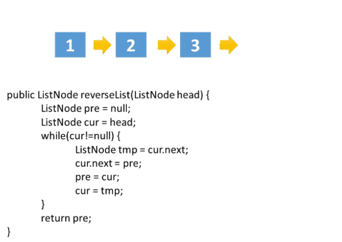
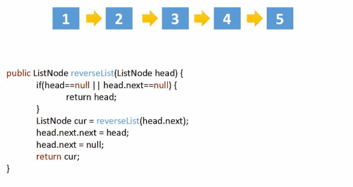

# [题目](https://leetcode-cn.com/problems/reverse-linked-list/)

反转一个单链表。假设链表为 $1 \rightarrow 2 \rightarrow 3 \rightarrow \varnothing$，要把它改成$\varnothing \leftarrow 1 \leftarrow 2 \leftarrow 3$。

示例：

```markdown
输入：head = [1,2,3,4,5]
输出：[5,4,3,2,1]
```

```java
/**
 * Definition for singly-linked list.
 */
public class ListNode {
    int val;
    ListNode next;
    ListNode() {}
    ListNode(int val) { this.val = val; }
    ListNode(int val, ListNode next) { this.val = val; this.next = next; }
}
```


# 迭代（双指针）



## 代码实现

```java
/**
 * 206.反转链表
 * @date 2021-3-7
 * @author chenzufeng
 */
public class No206_ReverseLinkedList {
    public static ListNode reverseLinkedList(ListNode head) {
        ListNode preNode = null;
        ListNode currentNode = head;

        while (currentNode != null) {
            // 临时节点
            ListNode tempNode = currentNode.nextNode;
            // 从前往后反转链表
            currentNode.nextNode = preNode;
            preNode = currentNode;
            currentNode = tempNode;
        }

        // 跳出while循环时，currentNode指向null
        return preNode;
    }
}
```


## 复杂度分析

- 时间复杂度：$O(n)$，假设$n$是列表的长度，时间复杂度是$O(n)$。
- 空间复杂度：$O(1)$。


# 递归



递归的关键在于反向工作。

**假设列表的其余部分已经被反转，现在该如何反转它前面的部分**？

假设列表为：$n_{1}\rightarrow ... \rightarrow n_{k-1} \rightarrow n_{k} \rightarrow n_{k+1} \rightarrow ... \rightarrow n_{m} \rightarrow \varnothing$，

若从节点$n_{k+1}$到$n_{m}$已经被反转，而当前正处于$n_{k}$：$n_{1}\rightarrow ... \rightarrow n_{k-1} \rightarrow n_{k} \rightarrow n_{k+1} \leftarrow ... \leftarrow n_{m}$

希望$n_{k+1}$的下一个节点指向$n_{k}$，所以，$n_{k}.nextNode.nextNode = n_{k}$，即$n_{k+1}.nextNode \rightarrow n_{k}$。

需要注意的是，$n_{1}$的下一个必须指向 $Ø$。如果忽略了这一点，链表中可能会产生循环。如果使用大小为 2 的链表测试代码，则可能会捕获此错误。

## 代码实现

```java
class ReverseLinkedList {
    public ListNode reverseList(ListNode head) {
        if(head == null || head.next == null)
            return head;
        
        ListNode cur =reverseList(head.next);
        // 局部的处理（head指向右，其余右侧部分都已反转了）
        head.next.next = head;
        head.next = null;
        return cur;
    }
}
```

## 复杂度分析

- 时间复杂度：$O(n)$，假设$n$是列表的长度，那么时间复杂度为$O(n)$。
- 空间复杂度：$O(n)$，由于使用递归，将会**使用隐式栈空间**。递归深度可能会达到$n$层。


