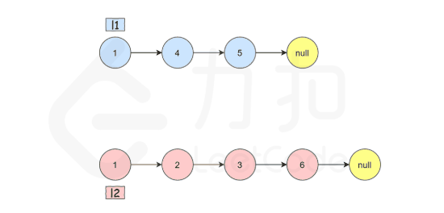

# [题目](https://leetcode-cn.com/problems/merge-two-sorted-lists/)

将两个`升序链表`合并为一个新的升序链表并返回。新链表是通过拼接给定的两个链表的所有节点组成的。 


```markdown
输入：l1 = [1,2,4], l2 = [1,3,4]
输出：[1,1,2,3,4,4]
```


# 递归

递归地定义两个链表里的 `merge` 操作（忽略边界情况，比如空链表等）：

$\left\{ \begin{array}{ll} list1[0] + merge(list1[1:], list2) & list1[0] < list2[0] \\ list2[0] + merge(list1, list2[1:]) & otherwise \end{array} \right.$


也就是说，【两个链表头部值较小的一个节点】与【剩下元素的 merge 操作结果】合并。

- 如果 `l1` 或者 `l2` 一开始就是空链表 ，那么没有任何操作需要合并，所以，只需要返回非空链表。
- 否则，<font color=red>要判断 `l1` 和 `l2` 哪一个链表的头节点的值更小，然后递归地决定下一个添加到结果里的节点</font>。
- 如果两个链表有一个为空，递归结束。

## 代码实现

```java
public class MergeTwoSortedList {
    public ListNode mergeTwoLists(ListNode listNode1, ListNode listNode2) {
        if (listNode1 == null) {
            return listNode2;
        } else if (listNode2 == null) {
            return listNode1;
        } else if (listNode1.val < listNode2.val) {
            listNode1.next = mergeTwoLists(listNode1.next, listNode2);
            return listNode1;
        } else {
            listNode2.next = mergeTwoLists(listNode1, listNode2.next);
            return listNode2;
        }
    }
}
```

## 复杂度分析

- 时间复杂度：$O(n + m)$，其中 $n$ 和 $m$ 分别为两个链表的长度。因为每次调用递归都会去掉`listNode1`或者`listNode2`的头节点（直到至少有一个链表为空），<font color=red>函数`mergeTwoList`至多只会递归调用每个节点一次。因此，**时间复杂度取决于合并后的链表长度**</font>，即$O(n+m)$。
- 空间复杂度：$O(n + m)$，其中 $n$ 和 $m$ 分别为两个链表的长度。<font>**递归调用`mergeTwoList`函数时需要消耗栈空间，栈空间的大小取决于递归调用的深度**</font>。结束递归调用时`mergeTwoList`函数最多调用 $n + m$ 次，因此空间复杂度为$O(n+m)$。


# 迭代

- 首先，设定一个哨兵节点`prehead`，<font color=red>在最后可以比较容易地返回合并后的链表</font>。然后，维护一个`current`指针，需要做的是调整它的`next`指针。
- 重复以下过程，直到`指针l1`或者`指针l2`指向了`null`：
  - 如果`l1`当前节点的值小于等于`l2`，就把`l1`当前的节点接在`prev`节点的后面，同时将`l1`指针往后移一位。
  - 否则，对`l2`做同样的操作。
  - **不管将哪一个元素接在了后面，都需要把`current`向后移一位**。

在循环终止的时候，`l1`和`l2`至多有一个是非空的。由于输入的两个链表都是有序的，所以不管哪个链表是非空的，它包含的所有元素都比前面已经合并链表中的所有元素都要大。这意味着只需要简单地将非空链表接在合并链表的后面，并返回合并链表即可。




## 代码实现

```java
public class MergeTwoSortedList {
    public ListNode mergeTwoLists(ListNode listNode1, ListNode listNode2) {
        ListNode preHead = new ListNode(-1);
        ListNode currentNode = preHead;

        while (listNode1 != null && listNode2 != null) {
            if (listNode1.val <= listNode2.val) {
                currentNode.next = listNode1;
                listNode1 = listNode1.next;
            } else {
                currentNode.next = listNode2;
                listNode2 = listNode2.next;
            }
            currentNode = currentNode.next;
        }

        // 此时l1和l2只有一个还未被合并完，直接将链表末尾指向未合并完的链表即可
        currentNode.next = (listNode1 == null) ? listNode2 : listNode1;
        
        return preHead.next;
    }
}
```


## 复杂度分析

- 时间复杂度：$O(n + m)$，其中 $n$ 和 $m$ 分别为两个链表的长度。因为每次循环迭代中，`listNode1`和`listNode2`只有一个元素会被放进合并链表中， 因此`while`循环的次数不会超过两个链表的长度之和。所有其他操作的时间复杂度都是常数级别的，因此总的时间复杂度为$O(n+m)$。

- 空间复杂度：$O(1)$只需要常数的空间存放若干变量。


