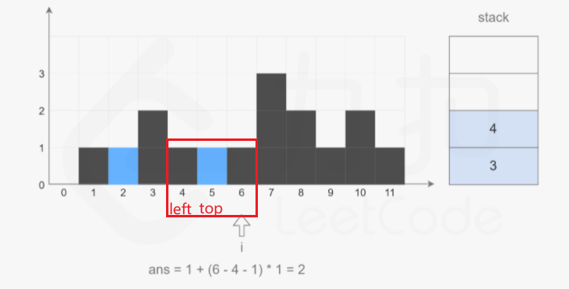
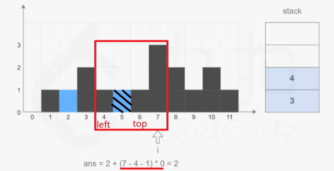
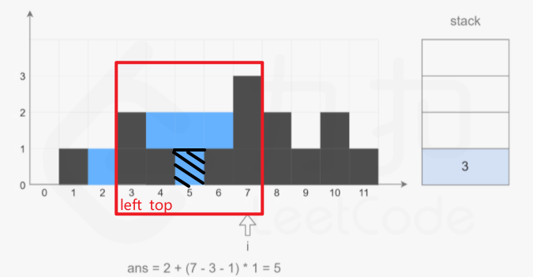

# [题目](https://leetcode-cn.com/problems/trapping-rain-water/)

给定$n$个非负整数表示每个宽度为1的柱子的高度图，计算按此排列的柱子，下雨之后能接多少雨水。

示例：


```
输入：height = [0,1,0,2,1,0,1,3,2,1,2,1]
输出：6
解释：上面是由数组 [0,1,0,2,1,0,1,3,2,1,2,1] 表示的高度图，在这种情况下，可以接6个单位的雨水（蓝色部分表示雨水）。 
```


## 解题思路

维护一个**单调栈**，单调栈存储的是**下标**，满足从栈底到栈顶的下标对应的数组$\textit{height}$中的元素**递减**。

从左到右遍历数组，遍历到下标$i$时，如果**栈内至少有两个元素**，记栈顶元素为$\textit{top}$，$\textit{top}$的下面一个元素是$\textit{left}$，则一定有$\textit{height}[\textit{left}] \ge \textit{height}[\textit{top}]$。

<font color=red>如果$\textit{height}[i]>\textit{height}[\textit{top}]$，**则得到一个可以接雨水的区域**，该区域的宽度是$i-\textit{left}-1$，高度是 $\min(\textit{height}[\textit{left}],\textit{height}[i])-\textit{height}[\textit{top}]$，根据宽度和高度即可计算得到该区域能接的雨水量。</font>为了得到$\textit{left}$，需要将$\textit{top}$出栈（此时$\textit{height}[i]>\textit{height}[\textit{top}]$）。**在对$\textit{top}$计算能接的雨水量之后，$\textit{left}$变成新的$\textit{top}$，重复上述操作**，直到**栈变为空**，或者**栈顶下标**对应的$\textit{height}$中的元素大于或等于$\textit{height}[i]$。

<font color=red>在对下标$i$处计算能接的雨水量之后，或者$\textit{height}[i]<\textit{height}[\textit{top}]$，则将$i$**入栈**</font>，继续遍历后面的下标，计算能接的雨水量。遍历结束之后即可得到能接的雨水总量。

<video src="../LeetCodePictures/42.接雨水.mp4" />

注意：

$3,4,5$依次入栈后，由于$6$的高度比$5$高，所以$5$要出栈，此时计算得到雨量为1：



由于$6$的高度和$4$的高度一致，所以$6$入栈。接着，由于$7$的高度比$6$的高度高，所以$6$出栈，然后计算水量为$0$：



接着$4$出栈：




## 代码实现

```java
import java.io.BufferedReader;
import java.io.IOException;
import java.io.InputStreamReader;
import java.util.Deque;
import java.util.LinkedList;

/**
 * 42.接雨水
 * @date 2021/5/17
 * @author chenzufeng
 */

public class No42_TrappingRainWater {
    public static void main(String[] args) throws IOException {
        BufferedReader reader = new BufferedReader(new InputStreamReader(System.in));
        String[] strings = reader.readLine().split(",");
        int[] heights = new int[strings.length];
        for (int i = 0; i < strings.length; i++) {
            heights[i] = Integer.parseInt(strings[i]);
        }

        System.out.println(trap(heights));
    }

    public static int trap(int[] heights) {
        int ans = 0;
        int length = heights.length;
        Deque<Integer> stack = new LinkedList<>();

        for (int i = 0; i < length; i++) {
            // 当栈不为空，且新d高度大于栈顶所对应的墙高度
            while (! stack.isEmpty() && heights[i] > heights[stack.peek()]) {
                int top = stack.pop();
                // 栈中仅有一个元素，抛出后为空栈
                if (stack.isEmpty()) {
                    break;
                }

                // 栈中至少有两个元素：抛出一个后还有一个
                int left = stack.peek();

                // 计算雨水量
                int currentWidth = i - left - 1;
                int currentHeight = Math.min(heights[left], heights[i]) - heights[top];
                ans += currentHeight * currentWidth;
            }

            // 新高度小于或等于栈顶所对应的高度直接入栈，或者计算完雨量后，新高度入栈
            stack.push(i);
        }

        return ans;
    }
}
```


## 复杂度分析

时间复杂度：$O(n)$，其中$n$是数组$\textit{height}$的长度。从$0$到$n-1$的每个下标最多只会入栈和出栈各一次。

空间复杂度：$O(n)$，其中$n$是数组$\textit{height}$的长度。空间复杂度主要取决于**栈空间**，栈的大小不会超过$n$。


