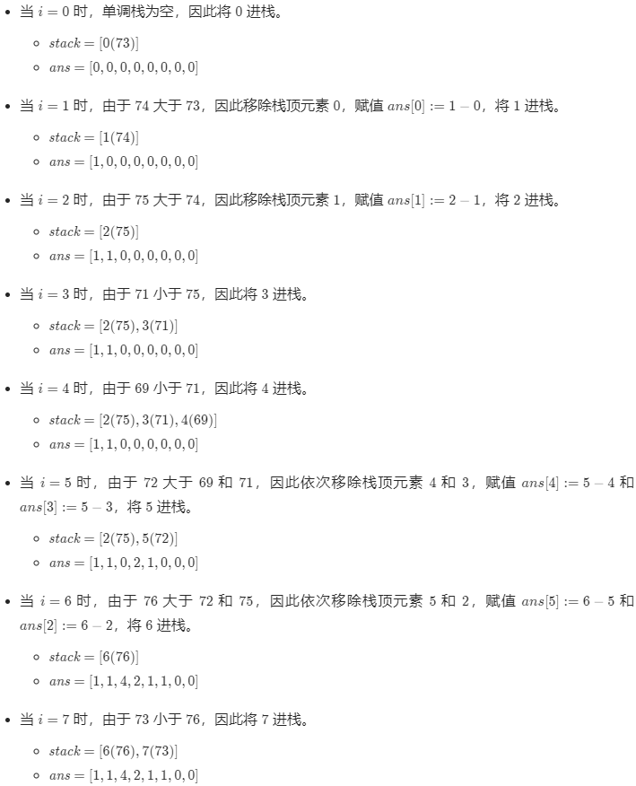

# [题目](https://leetcode-cn.com/problems/daily-temperatures/)

请根据每日气温列表，重新生成一个列表。对应位置的输出为：**要想观测到更高的气温，至少需要等待的天数**。如果气温在这之后都不会升高，请在该位置用`0`来代替。

示例：

```
给定一个列表
temperatures = [73, 74, 75, 71, 69, 72, 76, 73]
那么输出应该是 [1,  1,  4,  2,  1,  1,  0,  0]。
```


# 解题思路

[参考](https://leetcode-cn.com/problems/daily-temperatures/solution/leetcode-tu-jie-739mei-ri-wen-du-by-misterbooo/)

- 思路一：找到数组中当前数字右侧，第一个比它大的数字。

  从左到右除了最后一个数其他所有的数都遍历一次，最后一个数据对应的结果肯定是$0$，不需要计算。

  遍历的时候，每个数都去向后数，直到找到比它大的数，数的次数就是对应输出的值。

  

- 思路二：单调栈，即遍历一次数组，就找到全部的位置信息。

  可以维护一个存储下标的单调栈，从栈底到栈顶的下标对应的温度列表中的温度**依次递减**。**如果一个下标在单调栈里，则表示尚未找到下一次温度更高的下标**。

  正向遍历温度列表：

  对于温度列表中的每个元素`T[i]`

  - 如果栈为空，则直接将`i`进栈；
  - 如果栈不为空，则比较栈顶元素`prevIndex`对应的温度`T[prevIndex]`和当`前温度T[i]`
    - 如果`T[i] > T[prevIndex]`，则将`prevIndex`移除，并将`prevIndex`对应的等待天数赋为`i - prevIndex`
    - 重复上述操作直到**栈为空**或者**栈顶元素对应的温度小于等于当前温度**，然后将`i`进栈。

  <video src="../LeetCodePictures/739.mp4" />

  为什么可以在弹栈的时候更新`ans[prevIndex]`呢？

  因为在这种情况下，即将进栈的`i`对应的`T[i]`一定是`T[prevIndex]`右边第一个比它大的元素。如果`prevIndex`和`i`有比它大的元素，假设下标为`j`，那么`prevIndex`一定会在下标`j`的那一轮被弹掉。

  由于单调栈满足**从栈底到栈顶元素对应的温度递减**，因此**每次有元素进栈时，会将温度更低的元素全部移除，并更新出栈元素对应的等待天数**，这样可以确保等待天数一定是最小的。

  对于温度列表`[73,74,75,71,69,72,76,73]`，单调栈$\textit{stack}$的初始状态为空，答案$\textit{ans}$的初始状态是`[0,0,0,0,0,0,0,0]`，按照以下步骤更新单调栈和答案，其中单调栈内的元素都是下标，括号内的数字表示下标在温度列表中对应的温度：




# 代码实现

使用单调栈实现：

```java
import java.io.BufferedReader;
import java.io.IOException;
import java.io.InputStreamReader;
import java.util.Arrays;
import java.util.Deque;
import java.util.LinkedList;

/**
 * 739.每日温度
 * @date 2021/5/16
 * @author chenzufeng
 */

public class No739_DailyTemperature {
    public static void main(String[] args) throws IOException {
        BufferedReader reader = new BufferedReader(new InputStreamReader(System.in));
        String[] strings = reader.readLine().split(" ");
        int[] temperatures = new int[strings.length];
        for (int i = 0; i < strings.length; i++) {
            temperatures[i] = Integer.parseInt(strings[i]);
        }

        System.out.println(Arrays.toString(dailyTemperature(temperatures)));
    }

    static public int[] dailyTemperature(int[] T) {
        int length = T.length;
        int[] ans = new int[length];

        // stack用来存放温度的下标
        Deque<Integer> stack = new LinkedList<>();

        for (int i = 0; i < length; i++) {
            int temperature = T[i];
            // 栈不空，且栈顶元素小于当前温度（找到了prevIndex后更高的气温）
            while (!stack.isEmpty() && temperature > T[stack.peek()]) {
                int prevIndex = stack.pop();
                ans[prevIndex] = i - prevIndex;
            }

            // 形成一个单调减的栈
            stack.push(i);
        }

        return ans;
    }
}
```


# 复杂度分析

时间复杂度：$O(n)$，其中$n$是温度列表的长度。正向遍历温度列表一遍，对于温度列表中的每个下标，最多有一次进栈和出栈的操作。

空间复杂度：$O(n)$，其中$n$是温度列表的长度。需要维护一个单调栈存储温度列表中的下标。
