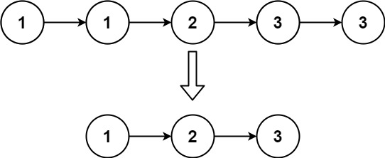

# [题目](https://leetcode-cn.com/problems/remove-duplicates-from-sorted-list/)

存在一个==按升序排列==的链表，给你这个链表的头节点 `head` ，请你删除所有重复的元素，使每个元素**只出现一次** 。

返回同样按升序排列的结果链表。



```java
/**
 * Definition for singly-linked list.
 */
public class ListNode {
    int val;
    ListNode next;
    ListNode() {}
    ListNode(int val) { this.val = val; }
    ListNode(int val, ListNode next) { this.val = val; this.next = next; }
}
```


# 解题思路

==由于给定的链表是排好序的，重复的元素在链表中出现的位置是连续的==，因此只需要对链表进行一次遍历，就可以删除重复的元素。

具体地，指针 $$\textit{cur}$$ 指向链表的头节点，随后开始对链表进行遍历。如果当前 $$\textit{cur}$$ 与 $$\textit{cur.next}$$ 对应的元素相同，那么就将 $$\textit{cur.next}$$ 从链表中移除；否则说明链表中已经不存在其它与 $$\textit{cur}$$ 对应的元素相同的节点，因此可以将 $$\textit{cur}$$ 指向 $$\textit{cur.next}$$。

当遍历完整个链表之后，返回链表的头节点即可。

# 代码实现

```java
/**
 * @author chenzufeng
 * @date 2021-07-11
 * 83. 删除排序链表中的重复元素
 */
public class No83_RemoveDuplicatesFromSortedList {
    public SinglyLinkedListNode removeDuplicatesFromSortedList(SinglyLinkedListNode head) {

        if (head == null) {
            return null;
        }

        SinglyLinkedListNode currentNode = head;
        while (currentNode.nextNode != null) {
            if (currentNode.value == currentNode.nextNode.value) {
                currentNode.nextNode = currentNode.nextNode.nextNode;
            } else {
                currentNode = currentNode.nextNode;
            }
        }

        return head;
    }
}
```

注意1：

```java
class Solution {
    public ListNode deleteDuplicates(ListNode head) {
        if (head == null) {
            return head;
        }
        ListNode currentNode = head;
        while (currentNode.next != null) {
            if (currentNode.val == currentNode.next.val) {
                currentNode.next = currentNode.next.next;
            }
            currentNode = currentNode.next;

            if (currentNode == null) {
                break;
            }
        }
        return head;
    }
}
```

这种写法没有考虑到特殊情况：

```markdown
输入：[1,1,1]
输出：[1,1]
```

注意2：要有异常情况处理

```java
if (head == null) {
        return head;
    }
```


# 复杂度分析

- 时间复杂度：$$O(N)$$，其中 $$n$$ 是链表的长度。
- 空间复杂度：$$O(1)$$。

