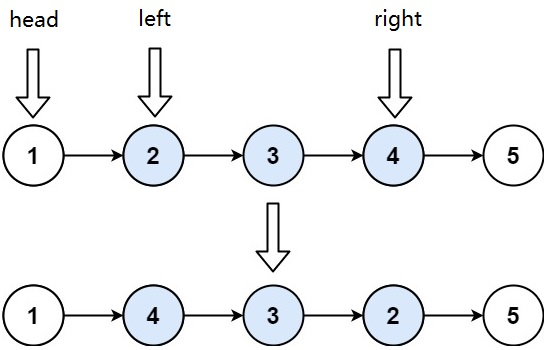
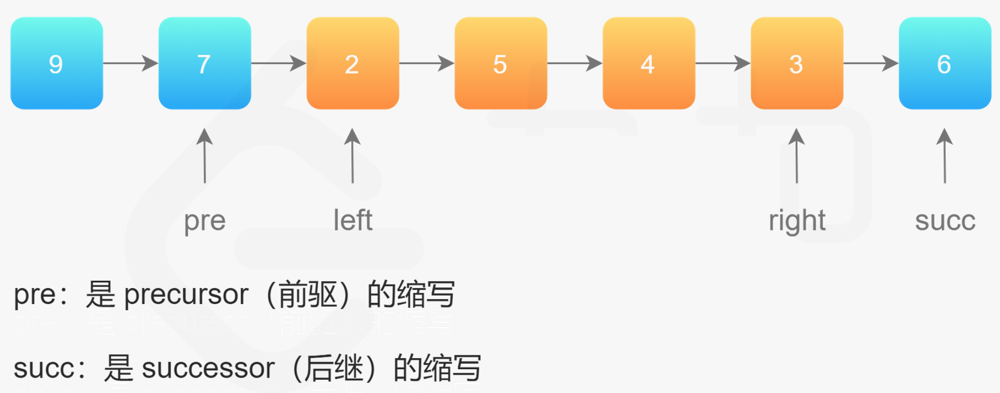
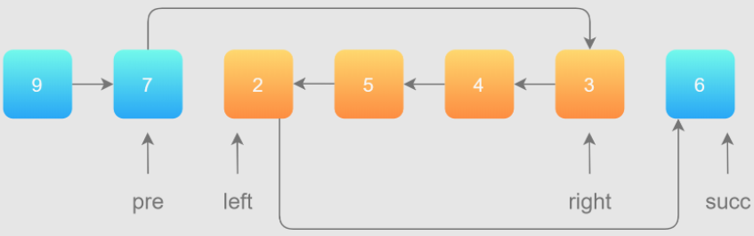
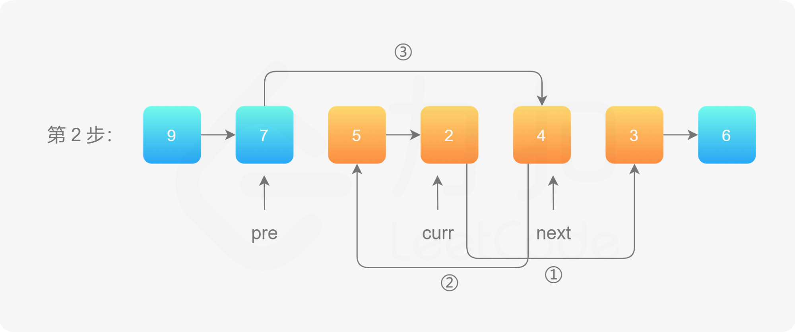
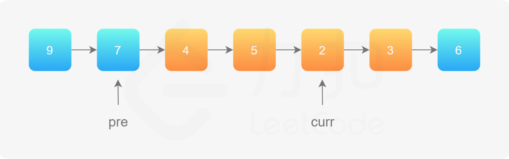
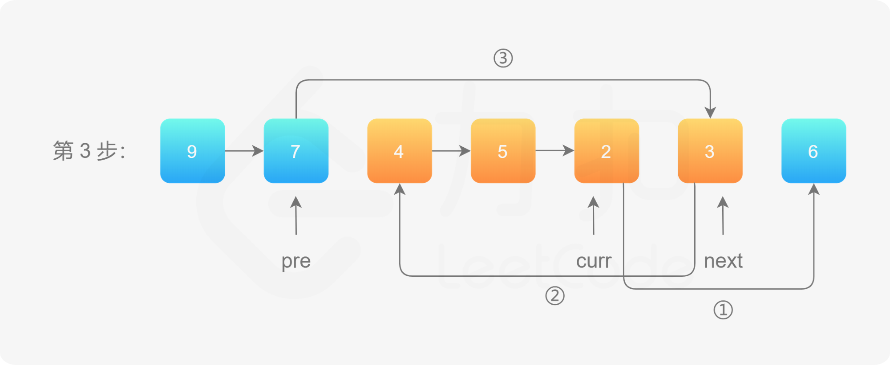

# [反转链表 II](https://leetcode-cn.com/problems/reverse-linked-list-ii/)

给你单链表的头指针 $head$ 和两个整数 $left$ 和 $right$ ，其中 $left \leq right$ 。请你反转从位置 $left$ 到位置 $right$ 的链表节点，返回反转后的链表 。


示例：



```markdown
输入：head = [1,2,3,4,5], left = 2, right = 4
输出：[1,4,3,2,5]
```

```java
/**
 * Definition for singly-linked list.
 */
public class ListNode {
    int val;
    ListNode next;
    ListNode() {}
    ListNode(int val) { this.val = val; }
    ListNode(int val, ListNode next) { this.val = val; this.next = next; }
}
```


# 遍历两次链表

将 $left$ 和 $right$ 部分反转后，再拼接起来！




第 1 步：先将待反转的区域反转；

第 2 步：把 $pre$ 的 $next$ 指针指向反转以后的链表头节点，把反转以后的链表的尾节点的 $next$ 指针指向 $succ$。



## 代码实现

```java
class Solution {
    public ListNode reverseBetween(ListNode head, int left, int right) {
        // 因为头节点有可能发生变化，使用虚拟头节点可以避免复杂的分类讨论
        ListNode dummyNode = new ListNode(-1);
        dummyNode.next = head;

        ListNode pre = dummyNode;
        // 第 1 步：从虚拟头节点走 left - 1 步，来到 left 节点的前一个节点
        // 建议写在 for 循环里，语义清晰
        for (int i = 0; i < left - 1; i++) {
            pre = pre.next;
        }

        // 第 2 步：从 pre 再走 right - left + 1 步，来到 right 节点
        ListNode rightNode = pre;
        for (int i = 0; i < right - left + 1; i++) {
            rightNode = rightNode.next;
        }

        // 第 3 步：切断出一个子链表（截取链表）
        ListNode leftNode = pre.next;
        ListNode succ = rightNode.next;

        // 注意：切断链接
        pre.next = null;
        rightNode.next = null;

        // 第 4 步：同第 206 题，反转链表的子区间
        reverseLinkedList(leftNode);

        // 第 5 步：接回到原来的链表中
        pre.next = rightNode;
        leftNode.next = succ;
        return dummyNode.next;
    }

    private void reverseLinkedList(ListNode head) {
        // 也可以使用递归反转一个链表
        ListNode pre = null;
        ListNode cur = head;

        while (cur != null) {
            ListNode next = cur.next;
            cur.next = pre;
            pre = cur;
            cur = next;
        }
    }
}
```


## 复杂度分析

- 时间复杂度：$O(N)$，其中 $N$是链表总节点数。最坏情况下，需要遍历整个链表。

- 空间复杂度：$O(1)$。只使用到常数个变量。


# 遍历一次链表

方法一的缺点是：如果 $left$ 和 $right$ 的区域很大，恰好是链表的头节点和尾节点时，找到 $left$ 和 $right$ 需要遍历一次，反转它们之间的链表还需要遍历一次，虽然总的时间复杂度为 $O(N)$，但遍历了链表 $2$ 次，可不可以只遍历一次呢？


整体思想是：<font color=red>在需要反转的区间里，每遍历到一个节点，让这个新节点来到反转部分的起始位置</font>。


<video src="../LeetCodePictures/92.mp4" />

具体实现步骤：

使用三个指针变量 pre、curr、next 来记录反转的过程中需要的变量，它们的意义如下：

- curr：指向待反转区域的第一个节点 left；
- next：永远指向 curr 的下一个节点，循环过程中，curr 变化以后 next 会变化；
- pre：永远指向待反转区域的第一个节点 left 的前一个节点，在循环过程中不变。

第 1 步，使用 ①、②、③ 标注「穿针引线」的步骤：


操作步骤：

1. 先将 curr 的下一个节点记录为 next；

2. 执行操作 ①：把 curr 的下一个节点指向 next 的下一个节点；

3. 执行操作 ②：把 next 的下一个节点指向 pre 的下一个节点；

4. 执行操作 ③：把 pre 的下一个节点指向 next。

第 1 步完成以后「拉直」的效果如下：


第 2 步，同理。同样需要注意 **「穿针引线」操作的先后顺序**：



第 2 步完成以后「拉直」的效果如下：



第 3 步，同理：



第 3 步完成以后「拉直」的效果如下：


## 代码实现

```java
class Solution {
    public ListNode reverseBetween(ListNode head, int left, int right) {
        ListNode dummyNode = new ListNode();
        dummyNode.next = head;
        ListNode preNode = dummyNode;

        // 找到中间待反转链表头节点的前一个节点
        for(int i = 0; i < left - 1; i++) {
            preNode = preNode.next;
        }

        ListNode currNode = preNode.next;
        ListNode nextNode;

        // 不停地将后面的节点搬到前面，只需要right - leftc
        for(int i = 0; i < right - left; i++) {
            nextNode = currNode.next;
            currNode.next = nextNode.next;
            nextNode.next = preNode.next;
            preNode.next = nextNode;
        }

        return dummyNode.next;
    }
}
```

## 复杂度分析

- 时间复杂度：$O(N)$，其中 $N$ 是链表总节点数。最多只遍历了链表一次，就完成了反转。
- 空间复杂度：$O(1)$。只使用到常数个变量。

